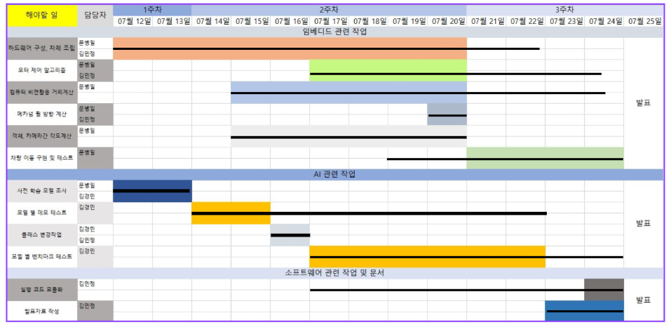
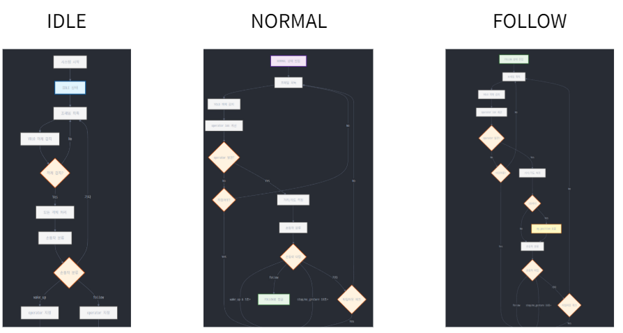
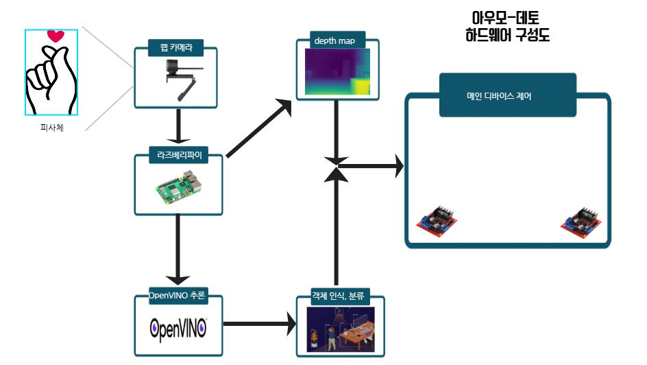
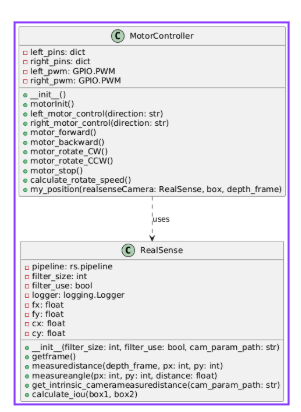
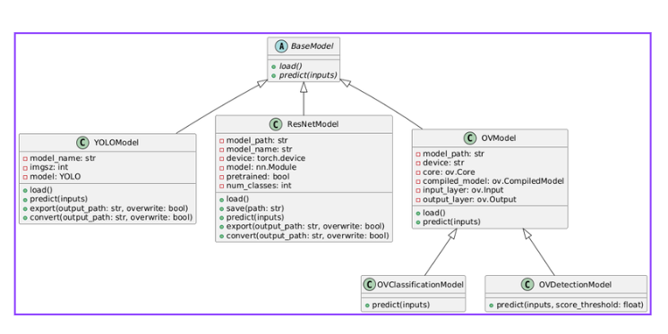
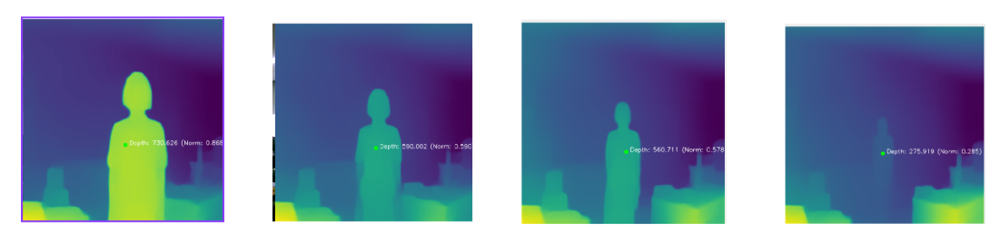
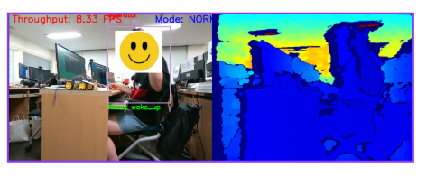
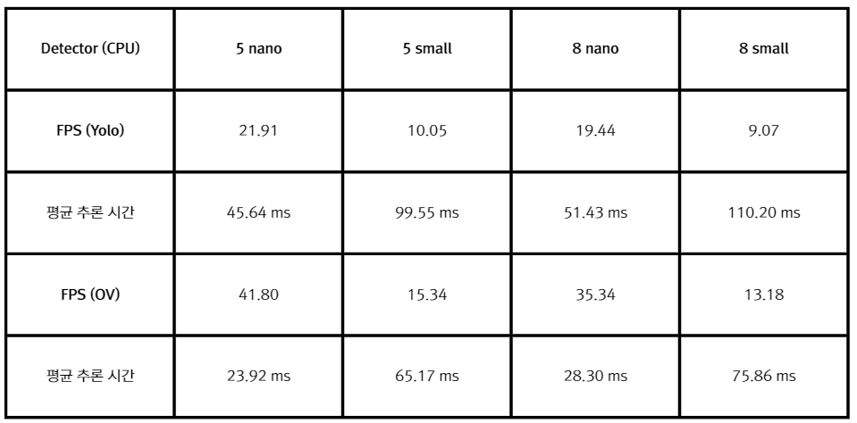

# 🚗 Au-mo Deto Solution | Auto-Moto Call with Object & Gesture Detection  


비젼(스테레오 비젼, monodepth estimation)기반 거리 측정 시스템과 객체 인식 모델을 융합한 팔로잉 로봇 카 프로젝트

다양한 상황에 대응되는 시나리오로 여러 기능을 제공(카 이동, 카 회전, 요청자 위치까지 이동, 요청자 따라가기)

여러 객체인식, 분류기 모델들의 벤치마킹을 통한 모델 기능 비교

---

## 🏗 High Level Design


---

## 💡 Use Case


---

## 📊 간트 차트



---

## ✋ 손동작 출력 라벨

| 제스처 | 의미 |
|--------|------|
| 🖐 one     | 전진 |
| ✌ two     | 후진 |
| 🤟 three2  | 제자리 회전 (우) |
| 🤘 three   | 제자리 회전 (좌) |
| ✊ fist    | 정지 |
| ✋ four    | 내 자리로 오기 |
| ✋✊ stop   | 따라오게 하기 |
| 🤟 rock    | 일반 모드 전환 (대기 상태 해제) |

---

## 🔁 시스템 흐름도 (Flowchart)



---

## 시스템 구성도


--

## 📌 주요 기술 스택

- `😯 Stereo Vision system ` : 스테레오 비젼 시스템 기반 거리 측정 시스템
- `🎥 Monodepth Estimation `: 깊이 인식 기반 거리 측정 및 방향 추정 (팔로잉 기능 및 요청자 위치까지 이동 기능에 활용)
- `👋 Hand Gesture Detection`: 요청자의 손동작에 따른 팔로잉 로봇 카 제어
- `🎯 Object Detection`: 사람 객체 인식기반으로 요청자 고정
- `🧠 모델 비교 및 벤치마킹`: 다양한 분류기/탐지 모델 성능 비교 후 프로젝트 적용 모델 선정

---

## model.pt

[resnet50_512_13.pt](https://drive.google.com/file/d/1XPes-AbSbVaECXIOqq8lI9KVgtjQ9sva/view?usp=drive_link)

---

## 기타 카메라 파라미터 및 MiDaS small IR format 다운로드 링크
[Camera_parameter.npz](https://drive.google.com/file/d/1U1zgCAN8ko_Zh77OCTNEXTZ4D10-5htZ/view?usp=drive_link)\
[MiDaS_small.bin, MiDas_msall.xml](https://drive.google.com/drive/folders/1GOaFV2Jkt80BED27tQxPsBZa5NOTey_w?usp=drive_link)


-->다운로드 후 npz파일은 camera디렉토리에 첨부. xml, bin 파일은 camera/models에 첨부.

**카메라 파라미터는 본인이 사용하는 webcam에 맞게 calibration을 직접 진행해주셔야합니다**

--

## 📂 클래스 다이어그램

효율적인 시스템 구현을 위해 필요한 모듈들을 직접 구현 ( 카메라 , 모터 , 인공지능 관련 기능들 모듈화)

### 🚗 모터, 카메라 관련 모듈



### 📡 인공지능 관련 모듈



---

## 실행

```
python3 -m venv .venv
source .venv/bin/activate
git clone https://github.com/david1597-embedded/aumo_reco_project.git
pip install -r requirements.txt
//테스트 실행
python3 test7_follow.py
```

---


## 📦 실습 하드웨어 환경

### 🛠️ 사용 하드웨어

| 하드웨어 | 설명 | 비고 |
|----------|------|------|
| **ABKO WebCam** | 일반 USB 웹캠 | 입력 영상 수집용. 주로 YOLO 및 ResNet50과 같은 모델의 실시간 추론에 사용됨. |
| **Intel Realsense (D435)** | 깊이 정보 획득 가능한 RGB-D 카메라 | Monodepth(MiDaS) 성능 비교 및 보완 목적. 실제 Depth와 MiDaS 추정 Depth 간 성능 비교 후 결정 |
| **Raspberry Pi 4B (4GB/8GB)** | ARM 기반 저전력 컴퓨팅 보드 | 전체 시스템 구동 및 모델 추론 담당. 특히 lightweight 모델 추론에 적합. |

---

### 🧠 사용 AI 모델

| 모델명 | 용도 | 비고 |
|--------|------|------|
| **YOLO (v5s/v8n 등)** | 객체 인식 (bounding box) | 실시간 처리에 최적화. | 
| **ResNet50** | 객체 분류 (classification) | 고정된 이미지의 label 분류용. Pi에서도 가능하나 추론 시간이 길어질 수 있음. | 
| **MiDaS (MiDaS Small)** | 단일 영상 기반 Depth 추정 | Monodepth 모델 중 비교적 경량화된 버전.  |

---

### 🛠️ 최적화 도구

| 도구명 | 용도 |
| ------ | -----|
| OpenVINO | 라즈베리파에서의 모델들의 추론 시간 최적화를 위한 도구|

## 💾 실행결과

### 📷 mono depth estimation



---

### 📹 real sense depth map



---

## 📣 벤치마크 결과


---


## 📎  참고
GitHub 링크

[https://github.com/hukenovs/hagrid](https://github.com/hukenovs/hagrid)

[https://github.com/openvinotoolkit/openvino_notebooks/blob/latest/notebooks/vision-monodepth/vision-monodepth.ipynb](https://github.com/openvinotoolkit/openvino_notebooks/blob/latest/notebooks/vision-monodepth/vision-monodepth.ipynb)

블로그 링크

[https://alida.tistory.com/59](https://alida.tistory.com/59)

[https://dsaint31.tistory.com/773](https://dsaint31.tistory.com/773)

[https://deep-learning00.tistory.com/23](https://deep-learning00.tistory.com/23)

---

