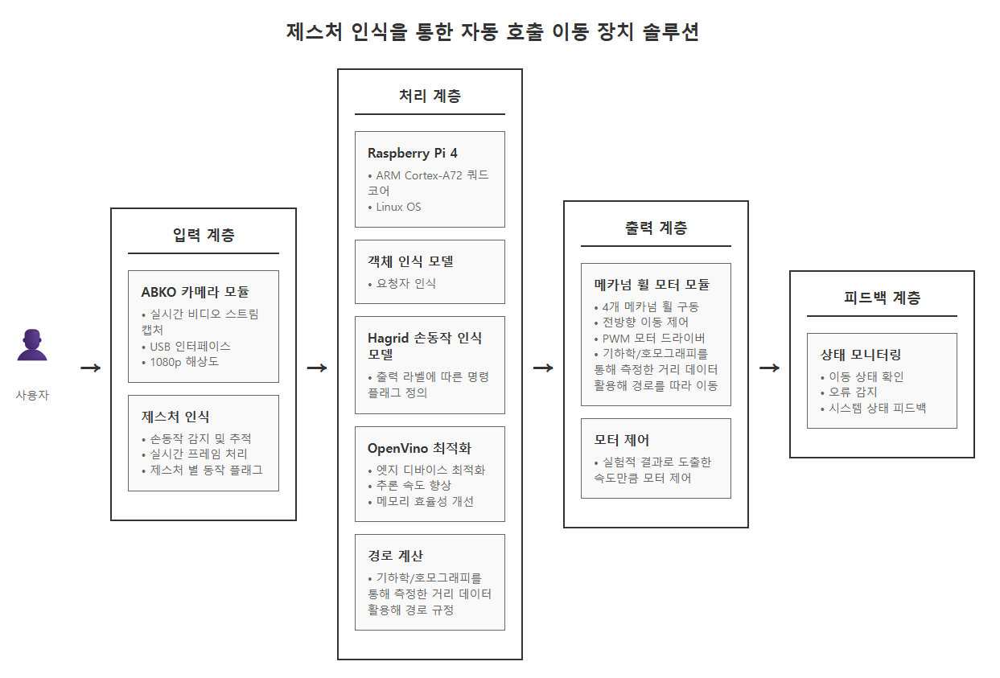
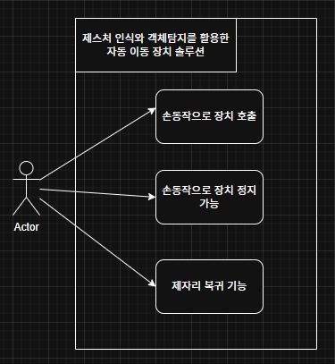
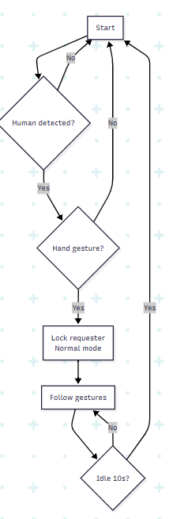

# Au-mo deto solution (Auto-moto call with object and hand gesture detection)
스테레오 비젼 시스템과 객체 인식 모델을 융합한 팔로잉 로봇 카 프로젝트

다양한 상황에 대응되는 시나리오로 여러 기능을 제공(카 이동, 카 회전, 요청자 위치까지 이동, 요청자 따라가기)

여러 객체인식, 분류기 모델들의 벤치마킹을 통한 모델 기능 비교

## High Level Desgin

## Use case

## 손동작출력 라벨
전진 -> one\
후진 -> two\
제자리회전(우) ->three2\
제자리회전(좌) ->three\
정지 -> fist\
내 자리로 오기 ->four\
따라오게 하기 ->stop\
일반 모드 전환(대기 상태 해제) -> rock\

## Flowchart

