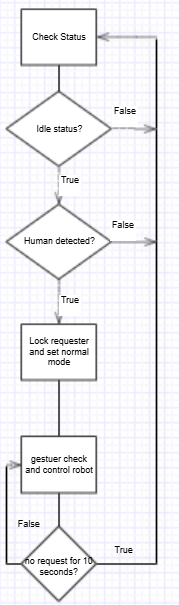

# 🚗 Au-mo Deto Solution | Auto-Moto Call with Object & Gesture Detection  

스테레오 비젼 시스템과 객체 인식 모델을 융합한 팔로잉 로봇 카 프로젝트

다양한 상황에 대응되는 시나리오로 여러 기능을 제공(카 이동, 카 회전, 요청자 위치까지 이동, 요청자 따라가기)

여러 객체인식, 분류기 모델들의 벤치마킹을 통한 모델 기능 비교

---

## 🏗 High Level Design

---

## 💡 Use Case

---

## ✋ 손동작 출력 라벨

| 제스처 | 의미 |
|--------|------|
| 🖐 one     | 전진 |
| ✌ two     | 후진 |
| 🤟 three2  | 제자리 회전 (우) |
| 🤘 three   | 제자리 회전 (좌) |
| ✊ fist    | 정지 |
| ✋ four    | 내 자리로 오기 |
| ✋✊ stop   | 따라오게 하기 |
| 🤟 rock    | 일반 모드 전환 (대기 상태 해제) |

---

## 🔁 시스템 흐름도 (Flowchart)

---

## 📌 주요 기술 스택

- `🎥 Stereo Vision`: 깊이 인식 기반 거리 측정 및 방향 추정 (팔로잉 기능 및 요청자 위치까지 이동 기능에 활용)
- `👋 Hand Gesture Detection`: 요청자의 손동작에 따른 팔로잉 로봇 카 제어
- `🎯 Object Detection`: 사람 객체 인식기반으로 요청자 고정
- `🧠 모델 비교 및 벤치마킹`: 다양한 분류기/탐지 모델 성능 비교 후 프로젝트 적용 모델 선정

---

## 📂 구조 및 폴더 설명

---

## 📎  참고
GitHub 링크

[https://github.com/hukenovs/hagrid](https://github.com/hukenovs/hagrid)

블로그 링크

[https://alida.tistory.com/59](https://alida.tistory.com/59)

[https://dsaint31.tistory.com/773](https://dsaint31.tistory.com/773)

[https://deep-learning00.tistory.com/23](https://deep-learning00.tistory.com/23)

---

